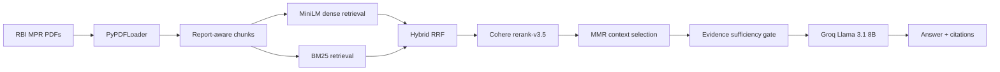

# Temporal Multi-Document RAG for RBI Monetary Policy Reports

This repository implements a temporal multi-document RAG system for RBI Monetary Policy Reports. It is designed to answer questions about **policy stance and narrative evolution** across report periods, with source-labelled evidence and explicit caveats when the retrieved context is insufficient.

Current status: local demo and interview-ready verification artifacts are available. The project is **not production-ready**.

## Verification entry points

- Root explainer: `RBI_RAG_Project_Explainer.html`
- Runnable explainer notebook: `Multi_Report_RAG_Explainer.ipynb`
- Dashboard/demo: `streamlit_app.py`
- Final project report: `reports/final_packaging/final_project_report.md`
- Master method comparison: `reports/final_comparison/rag_methods_master_comparison.md`
- Best-system summary: `reports/final_comparison/best_system_summary.md`

Regenerate the root explainer after metric/report changes:

```powershell
.\.venv\Scripts\python.exe scripts\generate_project_explainer_html.py
```

## Dataset

The multi-report corpus contains:

| Report | Report ID | Path |
|---|---|---|
| April 2025 RBI Monetary Policy Report | `rbi_mpr_2025_04` | `mpr_april_2025.pdf` |
| October 2025 RBI Monetary Policy Report | `rbi_mpr_2025_10` | `data/raw/Oct_2025_RBI_MPR.pdf` |
| April 2026 RBI Monetary Policy Report | `rbi_mpr_2026_04` | `data/raw/April_2026_RBI_MPR.pdf` |

## Pipeline



Core implementation:

- `src/rbi_rag/`: modular ingestion, retrieval, reranking, generation, evaluation, and packaging code
- `scripts/`: reproducible experiment/report generation commands
- `configs/`: selected configs and experiment matrices
- `data/evaluation/`: development and held-out evaluation question sets
- `reports/`: saved experiment outputs, integrity checks, and presentation reports
- `streamlit_app.py`: saved-example dashboard/demo

## Strategies evaluated

The project started as an April 2025 single-document RAG notebook and was refactored into a reproducible multi-report system.

Single-document baseline strategies:

| Strategy | Hit-Rate@4 | MRR |
|---|---:|---:|
| Dense retrieval | 83.33% | 0.6556 |
| Dense + reranker | 90.00% | 0.8278 |
| BM25 | 83.33% | 0.6917 |
| BM25 + reranker | 86.67% | 0.7667 |
| Hybrid RRF | 80.00% | 0.7444 |

These single-report metrics are preserved as historical baselines and are not directly comparable to multi-report Complete Evidence Recall.

Multi-report strategies:

- Report-aware temporal routing
- Dense + BM25 retrieval per required report
- Reciprocal Rank Fusion
- Cohere reranking
- Unstructured extraction attempt
- MMR context selection
- Groq generation over source-labelled context
- Evidence sufficiency gating
- Citation and temporal-attribution validation

## Current results

### Retrieval

| Method | CER | All-Reports Hit | Evidence Recall | Macro MRR | Median latency | Mean tokens |
|---|---:|---:|---:|---:|---:|---:|
| V2 local-reranker baseline | 36.67% | 40.00% | 50.56% | 0.3537 | 3,159 ms | 2,150.93 |
| V2 Cohere retrieval | 46.67% | 50.00% | 60.00% | 0.4154 | 12,948 ms | 2,097.20 |
| MMR lambda 0.6 retrieval | 53.33% | 56.67% | 65.00% | 0.4055 | 15,217 ms | 2,037.03 |

Best retrieval-only configuration after MMR testing: `MMR_LAMBDA_06`.

### Generation

Best evaluated generation setting in the current checkout: `V2_COHERE_ONLY + Groq llama-3.1-8b-instant + sufficiency gate`.

| Metric | Value |
|---|---:|
| Factual correctness | 79.54% |
| Faithfulness to context | 97.62% |
| Contextual relevancy | 52.94% |
| Contextual recall | 41.18% |
| Abstention correctness | 100.00% |
| Citation correctness | 88.24% |
| Citation completeness | 100.00% |
| Temporal attribution correctness | 88.24% |
| Comparative correctness | 27.78% |

Generation metrics are deterministic development checks, not human evaluation.

### Table/numeric questions

| Experiment | Slice | CER | Evidence Recall | Macro MRR |
|---|---|---:|---:|---:|
| V2 local-reranker baseline | table/numeric questions | 25.00% | 40.83% | 0.2750 |
| V2 Cohere retrieval | table/numeric questions | 40.00% | 55.00% | 0.3668 |
| V2 local-reranker baseline | table source pages | 25.00% | 45.83% | 0.3906 |
| V2 Cohere retrieval | table source pages | 37.50% | 64.58% | 0.5521 |

## Main insights

- Multi-report retrieval is materially harder than single-document retrieval because every required report must be covered.
- Cohere reranking improved retrieval quality, especially table/numeric recovery, but increased latency.
- MMR lambda 0.6 improved Complete Evidence Recall and All-Reports Hit by reducing repeated/redundant context.
- Macro MRR and MMR optimize different things: MRR measures rank quality; MMR selects diverse final context.
- The sufficiency gate made answer behavior safer by forcing abstention or caveats when retrieved evidence was incomplete.
- Unstructured extraction was attempted, but the current PDFs require OCR/Tesseract for usable extraction in this environment.

## How to run locally

```powershell
python -m venv .venv
.\.venv\Scripts\Activate.ps1
python -m pip install -r requirements.txt
python -m pip install -r requirements-v2.txt
python -m pip install -e .
```

Create `.env` locally if running API-backed steps:

```text
GROQ_API_KEY=...
COHERE_API_KEY=...
UNSTRUCTURED_API_KEY=...  # optional; OCR/Tesseract is also required for the blocked Unstructured path
```

Run the dashboard:

```powershell
streamlit run streamlit_app.py
```

Run validation:

```powershell
.\.venv\Scripts\python.exe -m compileall -q src scripts
.\.venv\Scripts\python.exe -m pytest
.\.venv\Scripts\python.exe -m pip check
```

## Key caveats

- Final V2 generation results are development-only.
- The old Phase 7 held-out set must not be presented as a fresh unbiased V2 benchmark.
- Generation metrics are deterministic heuristic checks, not human or external judge results.
- Final generation bake-off artifacts are incomplete in the current checkout, so the safest evaluated generation claim remains V2 Cohere retrieval plus sufficiency-gated generation.
- The system is not production-ready.

## Future scope

- Build a fresh V2 held-out evaluation set.
- Add human evaluation or robust LLM-judge evaluation.
- Install Tesseract/OCR and rerun Unstructured extraction deliberately.
- Cache Cohere reranker calls and expose API latency separately.
- Add history-aware query rewriting for conversational follow-ups.
- Promote Streamlit from saved-example demo mode to guarded live-query mode.
- Add deployment hardening, observability, monitoring, and rate-limit handling before any production claim.
