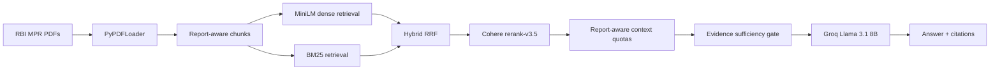

# Temporal Multi-Document RAG for RBI Monetary Policy Reports

A retrieval-augmented generation project for comparing RBI Monetary Policy Reports across time, focused on policy stance and narrative evolution rather than generic sentiment analysis.



## Dataset

- April 2025 RBI Monetary Policy Report
- October 2025 RBI Monetary Policy Report
- April 2026 RBI Monetary Policy Report

## Key features

- Report-aware retrieval and context quotas
- Temporal comparison across reports
- Hybrid dense + BM25 search
- Reciprocal Rank Fusion
- Cohere reranking
- Sufficiency gate for abstention/caveats
- Source-labelled citations
- Temporal attribution checks

## Results summary

| Best retrieval method | CER | All-Reports Hit | Evidence Recall | Macro MRR | Median latency ms | Mean tokens |
|---|---:|---:|---:|---:|---:|---:|
| V2 Cohere retrieval | 0.4667 | 0.5000 | 0.6000 | 0.4154 | 12906.78 | 2096.97 |

Retrieval-only winner after MMR testing: `MMR_LAMBDA_06`. Generation was not rerun on MMR, so the generation table below remains the saved V2 Cohere + sufficiency-gated result.

| Best generation method | Factual | Faithfulness | Abstention | Citation | Temporal attribution | Comparative |
|---|---:|---:|---:|---:|---:|---:|
| V2 Cohere + sufficiency gate | 0.7954 | 0.9762 | 1.0000 | 0.8824 | 0.8824 | 0.2778 |

Single-document Hit-Rate@4 is preserved as a historical baseline but is not directly comparable with multi-report Complete Evidence Recall.

## How to run

```powershell
python -m venv .venv
.\.venv\Scripts\Activate.ps1
python -m pip install -r requirements.txt
python -m pip install -r requirements-v2.txt  # optional V2/Cohere/Streamlit extras
```

Create `.env` locally with:

```text
GROQ_API_KEY=...
COHERE_API_KEY=...
UNSTRUCTURED_API_KEY=...  # optional; Unstructured remains OCR/Tesseract-blocked here
```

Useful commands:

```powershell
python scripts\run_mmr_experiments.py
python scripts\validate_mmr_experiments.py
python scripts\generate_mmr_report.py
python scripts\generate_final_rag_comparison.py
streamlit run streamlit_app.py
python -m pytest
```

## Repository structure

- `src/rbi_rag/`: modular RAG, evaluation, comparison, and packaging code
- `scripts/`: executable project workflows
- `configs/`: selected retrieval and experiment configs
- `data/`: raw reports and evaluation data
- `reports/`: saved evaluation, comparison, and final packaging artifacts
- `streamlit_app.py`: saved-example demo UI

## Evaluation methodology

Retrieval is measured with Complete Evidence Recall, All-Reports Hit, Evidence Recall, Macro Report MRR, report coverage, contamination, latency, and context-size metrics. Generation is evaluated on saved development outputs with deterministic heuristic checks for factuality, faithfulness, citations, temporal attribution, comparative correctness, and abstention.

## Limitations

- Final V2 generation is development-only.
- Old Phase 7 held-out results are historical and not a fresh V2 benchmark.
- Generation metrics are deterministic heuristics, not human evaluation.
- Cohere adds latency.
- Unstructured extraction was blocked by OCR/Tesseract requirements for these PDFs.
- This is not production-ready.

## Safety and security

API keys are read from `.env`; keys are not committed and generated artifacts are scanned for accidental key serialization.

## Interview-ready summary

This is a temporal multi-document RAG system for RBI Monetary Policy Reports. The strongest current system uses report-aware hybrid retrieval, Cohere reranking, Groq generation, and a sufficiency gate to reduce unsupported answers while keeping citations and temporal attribution explicit.
